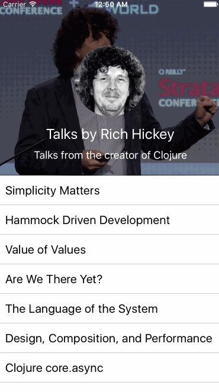

# react-native-parallax-scroll-view

A `ScrollView`-like component with parallax and sticky header support.


Tested with react-native 0.16.0 on Android and iOS.

## Installation

```
$ npm install react-native-parallax-scroll-view --save
```

## Demo


| iOS | Android |
| --- | ------- |
|  |  |

## Basic Usage

```js
import ParallaxScrollView from 'react-native-parallax-scroll-view';

// Inside of a component's render() method:
render() {
  return (
    <ParallaxScrollView
      headerBackgroundColor="blue"
      contentBackgroundColor="pink"
      parallaxHeaderHeight={300}
      renderParallaxHeader={() => (
       <View style={{ height: 300, flex: 1, alignItems: 'center', justifyContent: 'center' }}>
          <Text>Hello World!</Text>
        </View>
      )}>
      <View style={{ height: 500 }}>
        <Text>Scroll me</Text>
      </View>
    </ParallaxScrollView>
  );
}
```

## Examples

Please refer to the [Example](./Example/example.js) provided to see how `ParallaxScrollView` can be used in
combination with `ListView`.

The [Android example](./Example/index.android.js) shows how you can use `PullToRefreshViewAndroid` with `ParallaxScrollView`.

## Usage (API)

All of the properties of `ScrollView` are supported. Please refer to the
[`ScrollView` documentation](https://facebook.github.io/react-native/docs/scrollview.html) for more detail.

The `ParallaxScrollView` component adds a few additional properties, as described below.

| Property | Type | Required | Description |
| -------- | ---- | -------- | ----------- |
| `renderParallaxHeader` |  `func` | **Yes** |This renders the parallax header above the background. |
| `parallaxHeaderHeight` | `number` | **Yes** |This is the height of parallax header. |
| `headerBackgroundColor` | `string` | No | This is the background color of the sticky header, and also used as parallax header background color if `renderBackground` is not provided. (Defaults to `'#000'`) |
| `contentBackgroundColor` | `string` | No | This is the background color of the content. (Defaults to `'#fff'`) |
| `renderBackground` | `func` | No | This renders the background of the parallax header. Can be used to display cover images for example. (Defaults to an opaque background using `headerBackgroundColor`) |
| `renderStickyHeader` | `func` | No | This renders an optional sticky header that will stick to the top of view when parallax header scrolls up. |
| `stickyHeaderHeight` | `number` | If `renderStickyHeader` is used | If `renderStickyHeader` is set, then its height must be specified. |
| `renderFixedHeader` | `func` | No | This renders an optional fixed header that will always be visible and fixed to the top of the view (and sticky header). You must set its height and width appropriately. |
| `renderScrollComponent` | `func` | No | A function with input `props` and outputs a `ScrollView`-like component in which the content is rendered. This is useful if you want to provide your own scrollable component. (See: [https://github.com/exponentjs/react-native-scrollable-mixin](https://github.com/exponentjs/react-native-scrollable-mixin)) (By default, returns a `ScrollView` with the given props) |
